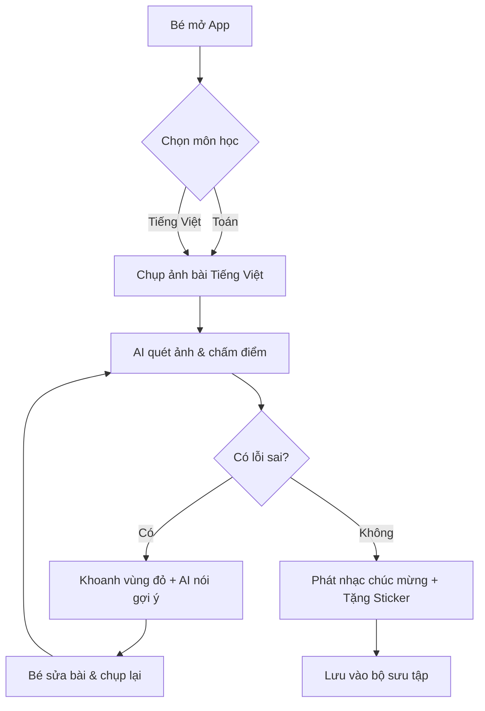

# 📄 Detailed Specs: AI Tutor Lớp 1

## 1. Executive Summary
Ứng dụng Web hướng tới học sinh lớp 1, giúp các bé tự học bằng cách chấm điểm bài tập qua ảnh chụp. Điểm khác biệt là AI không cho đáp án mà chỉ khoanh vùng lỗi sai và dùng giọng nói khích lệ bé tự sửa bài.

## 2. User Stories
- **Là một học sinh:** Em muốn chụp ảnh bài toán và biết ngay mình làm sai ở đâu để em sửa lại.
- **Là một phụ huynh:** Tôi muốn con mình tự lập hơn trong việc học và không phải ngồi canh con làm từng câu.
- **Là một phụ huynh:** Tôi muốn thấy con vui vẻ khi nhận được sticker sau mỗi lần cố gắng.

## 3. Database Design
- **Users Table:** id, name, avatar, total_stickers.
- **Homework Table:** id, user_id, subject (Toán/Tiếng Việt), image_url, grading_result (JSON), created_at.
- **Stickers Table:** id, user_id, sticker_type, earned_at.

## 4. Logic Flowchart (Mermaid)

## 5. UI Components
- **Dashboard:** Nút môn học to, bảng vàng Sticker.
- **CameraView:** Giao diện chụp ảnh đơn giản.
- **ResultView:** Hiển thị ảnh kèm ghi chú của AI.
- **StickerModal:** Hiệu ứng nổ pháo hoa và tặng quà.

## 6. Tech Stack
- Next.js (React Framework)
- TailwindCSS (Styling)
- Google Gemini 1.5 Flash (Vision & Reasoning)
- Supabase (Database & Storage)

## 7. Build Checklist
- [ ] Chống lag khi upload ảnh dung lượng lớn.
- [ ] Giọng nói AI phải rõ ràng, tốc độ chậm phù hợp với trẻ em.
- [ ] Đảm bảo bảo mật hình ảnh cá nhân của bé.
